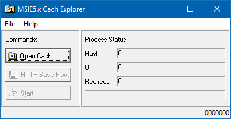

# MSIECacheExtractor
A tiny old utility application to Extractor Microsoft Internet Explorer Web Cache

During 1990s when Internet access was with dial-up with speeds of 9600 Bps to max 19200, 38400 Bps (not Kbps,Mbps or Gbps) browsing internet was a luxury thing and costly and you wanted to have a copy of what you have seen in Internet, in your local computer too. Especially when you were looking for an RFC and your connection would drop and Internet explorer would save "page cannot be loaded instead" of the actual page. So I made this app, I would just browse around, and look at what I wanted and then after finished the session (that would normally done by mom picking up the phone to call someone) I could run my app and have a copy of the website in my own PC.
This app would create folders for each website, then folders and files in them, so most websites would work without need to change anything. After Internet Explorer 6 this app become redundant since I was using Firefox and my line wasn't dialup anymore, so I didn't upgrade it anymore. This app is here as history of my work and I will not modify it.

Maybe we find a use for it if an apocalypse happen which cause Internet and PCs collapse and then when we have no choice other than installing Windows 95 and Internet Explorer 6 on Tesla computer to send S.O.S. to National Guard.
